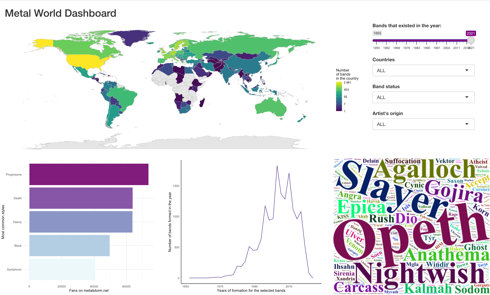

(revisited)

Source of the data: metalstorm.net

There are 6 variables available from metalstorm.net:

1. band_name - names of the metal band 
2. style - style(s) of metal performed by the bands
3. origin - country(ies) the band comes from
4. formed - year of formation
5. split - year of split (if band doesn't exist anymore)
6. fans - number of fans on metalstorm.net 


Other files:

* `./data` contains scraped data from original app
* `./other` contains older files for scrapping the data (may not work anymore)


## How to install

### Install Metal-World-Dashboard anywhere else with Docker

You can run Metal-World-Dashboard on any x86 or arm64 system. Make sure you have Docker installed.

Then, clone this repo and `cd` into it:

``` bash
git clone https://github.com/Kiril-Mordan/metal-world-shiny-dashboard.git
cd metal-world-shiny-dashboard
```

Build docker for running: 

``` bash
docker-compose build
docker compose up
```

You can access Metal-World-Dashboard at http://localhost:3838.

To stop it, run:

```
docker compose down
```

### Run locally with renv

Make sure you have R installed on your system.

Then, clone this repo and `cd` into it:

``` 
git clone https://github.com/Kiril-Mordan/metal-world-shiny-dashboard.git
cd metal-world-shiny-dashboard
```

Make sure your path in R console is also set in the same directory and
install dependencies with `renv.lock`:

``` r
renv::restore()
```

Scrape latest data:

``` r
source("scr/scrape_metalstorm_data.R")
```

Run the app locally:

``` r
shiny::runApp("Metal_world_shiny_app/")
```

Notes:

* map may not show at first or have troubles refreshing itself, resizing the browser windows generally helps

** the goal of the revisiting was to tryout some docker capabilities and make sure the app retains most of its original functionalities with little refactoring
