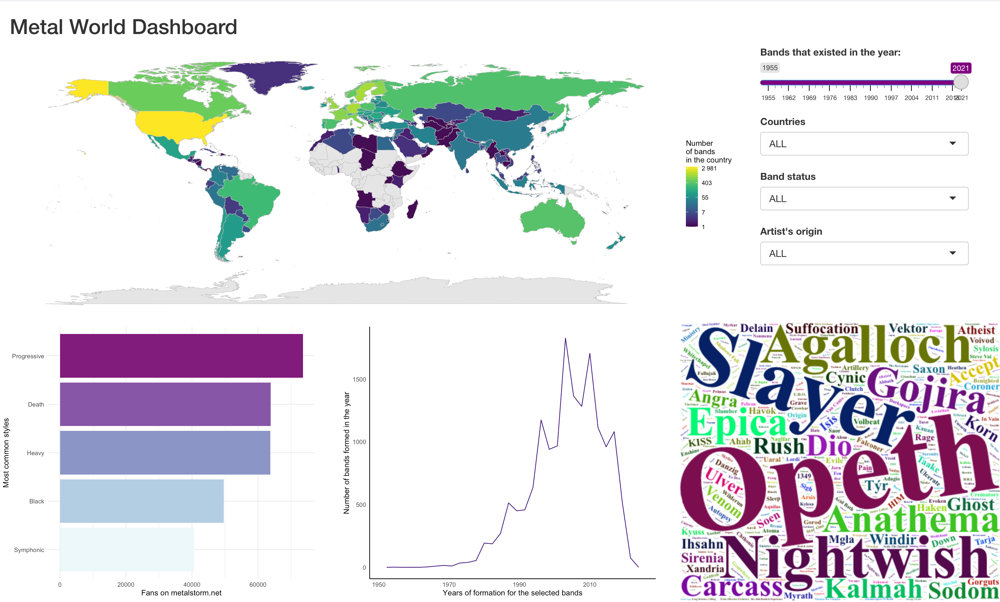

Data was scraped from metalstorm.net

There are 6 variables available on metalstorm.net:

1. band_name - names of the metal band 
2. style - style(s) of metal performed by the bands
3. origin - country(ies) the band comes from
4. formed - year of formation
5. split - year of split (if band doesn't exist anymore)
6. fans - number of fans on metalstorm.net 

Assumptions: 

1. Number of fans on metalstorm.net are representative
2. When no year of formation is available, the last year from the data is assigned
3. Some countries had to be renamed and some bands assigned to other countries due to limitations of the ggplot2 map_data() function 
4. When one country is provided in the data, band is assumed to be "national" for the sake of simplification even though it might have members from different countries, and for the that reason "national" "international" distinction may be flawed 
5. Number in the world map label are on the log scale so colours will be more distinct visually

Warning: 

Shiny app may not work on Windows due to the use of the mclapply function from parallel package. If the problem occures, pls use Metal_World_win, which uses foreach but runs slower 
